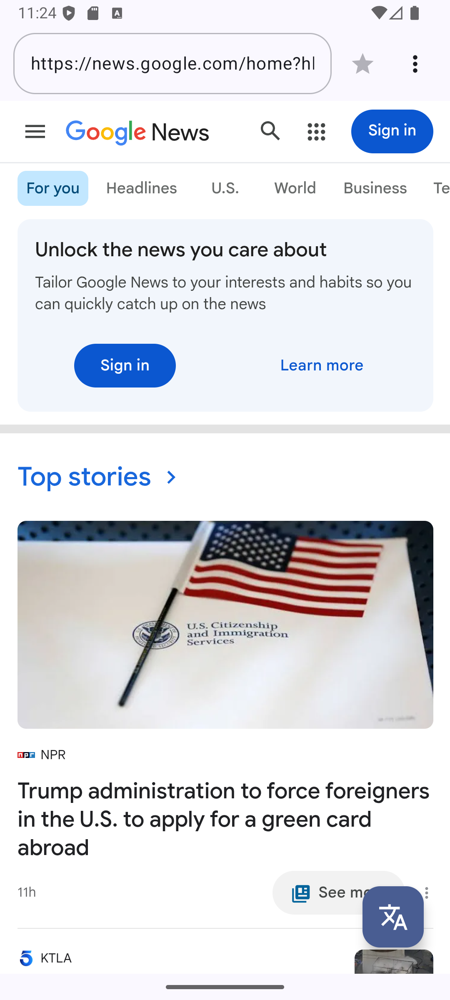
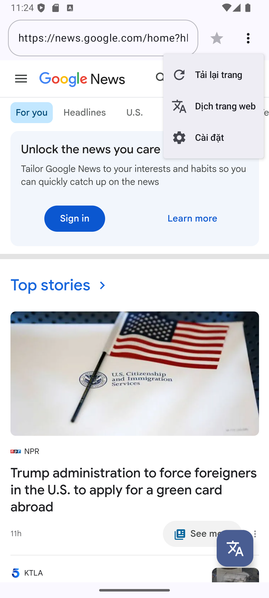
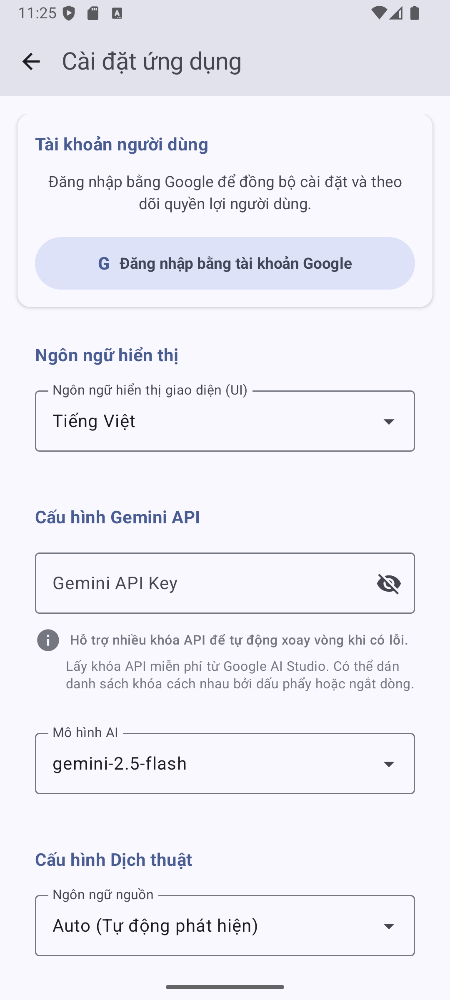
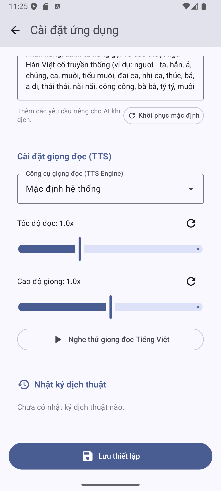
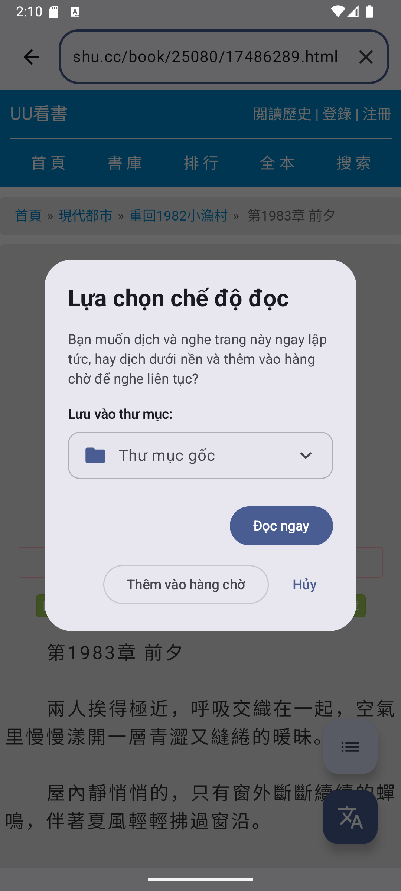
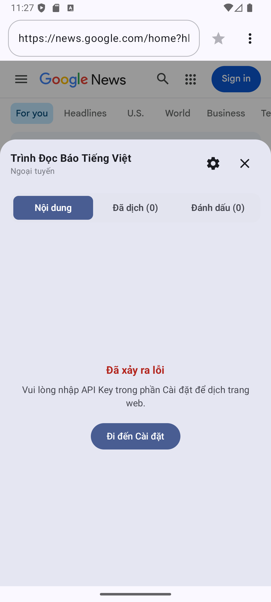
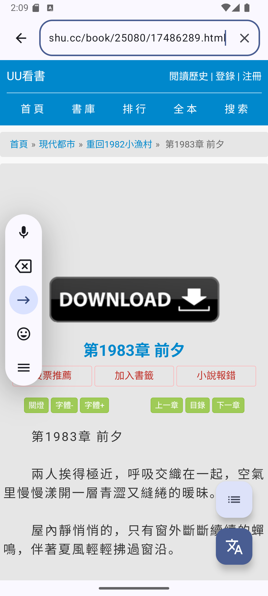
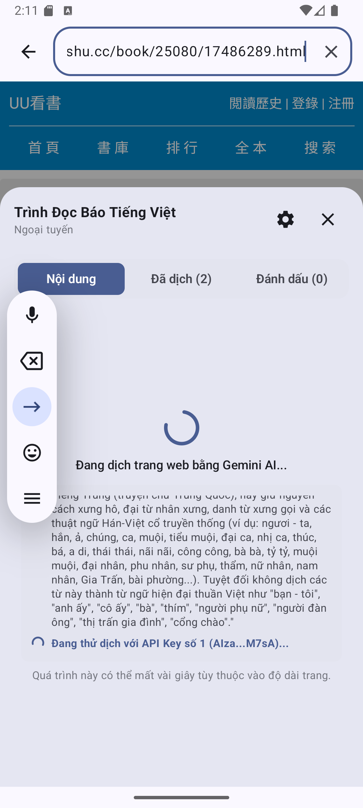
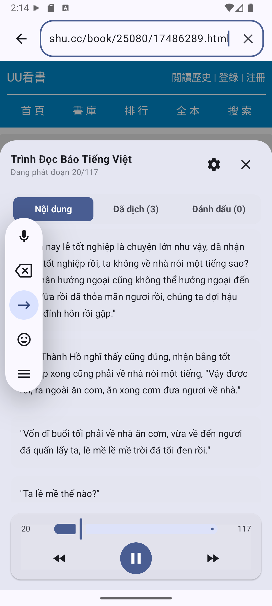
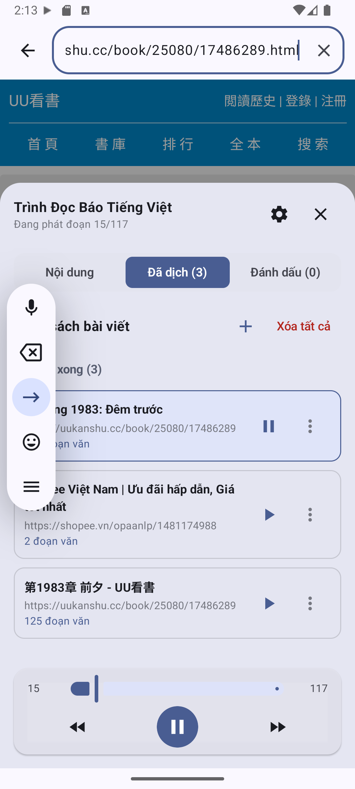

# WebAITransTTS - AI Translation & Text-to-Speech Integrated Web Reader Browser

[Tiếng Việt](#vietnamese) | [English](#english) | [简体中文](#chinese)

---

## <a name="vietnamese"></a>🇻🇳 Tiếng Việt - Trình Duyệt Đọc Truyện & Dịch Thuật AI Tích Hợp TTS

**WebAITransTTS** là một ứng dụng Android hiện đại được phát triển bằng Kotlin và Jetpack Compose. Ứng dụng được thiết kế chuyên biệt để duyệt web, đọc truyện chữ, dịch thuật chất lượng cao bằng AI (Gemini) và nghe đọc bằng giọng nói (Text-to-Speech) hoạt động bền bỉ, mượt mà kể cả khi tắt màn hình hoặc chạy dưới nền.

### 🌟 Các Tính Năng Nổi Bật

#### 1. Trình Duyệt Web Chrome-like Hiện Đại
- **Giao diện tối giản:** Thanh công cụ phía trên tối ưu, tự động co giãn thanh địa chỉ khi nhập liệu, tích hợp nút Đánh dấu trang (Bookmark) độc lập có màu vàng Gold trực quan.
- **Duyệt web mượt mà:** Ẩn các nút điều hướng thừa, người dùng vuốt cạnh màn hình để quay lại trang trước hoặc đi tiếp.

#### 2. Dịch Toàn Trang Web Tại Chỗ (In-place Translation)
- **Không dùng Proxy:** Sử dụng trực tiếp Google Translate Element Widget nhúng vào WebView để dịch tại chỗ sang Tiếng Việt.
- **Dịch tự động chuyển chương:** Tự động áp dụng dịch thuật khi người dùng nhấn chuyển chương mới nhờ cơ chế lưu cookie `googtrans=/auto/vi`.
- **Bảo toàn nguyên tác gốc cho AI:** Tự động sao lưu mã nguồn chữ gốc (tiếng Trung/tiếng Anh) vào cache trước khi Google dịch sửa đổi. Nhờ đó, tính năng Dịch AI & đọc TTS bằng Gemini vẫn hoạt động chính xác 100% dựa trên nguyên tác gốc.

#### 3. Dịch Thuật AI Nâng Cao Với Gemini & Dịch Streaming
- **Dịch truyền trực tuyến (Streaming):** Bản dịch từ Gemini API được cập nhật liên tục theo thời gian thực. Người dùng có thể bắt đầu đọc và nghe TTS ngay khi đoạn đầu tiên được dịch xong.
- **Trích xuất thông minh (Hybrid DOM Extractor):** Tự động loại bỏ quảng cáo, menu điều hướng, script, style rác... Chỉ giữ lại phần chương truyện/bài viết chính để dịch thuật, giúp tiết kiệm số lượng Token.
- **Văn phong Literary chuẩn:** Prompt dịch thuật được tối ưu hóa cho truyện chữ, ghép trực tiếp phần chỉ dẫn cá nhân hóa của người dùng vào prompt hệ thống (ví dụ: giữ lại các thuật ngữ xưng hô Hán-Việt cổ truyền thống `ngươi - ta, hắn, ả, ca, muội, tỷ tỷ, muội muội, thúc, bá, thẩm, thái thái, nãi nãi, công công, đại nhân, phu nhân, sư phụ, nữ nhân, nam nhân, Gia Trấn, bài phường...`).
- **Tự động dịch tiêu đề:** Tiêu đề chương truyện được dịch sang tiếng Việt tự động trước khi lưu.

#### 4. Đọc Giọng Nói (TTS) Chạy Nền Bền Bỉ (Background Playback)
- **Khắc phục lỗi đóng băng nền:** Giải quyết triệt để cơ chế tối ưu pin khắc nghiệt trên các dòng điện thoại Android Trung Quốc (OriginOS, HyperOS, ColorOS...) bằng sự kết hợp của:
  - Khởi chạy coroutines chuyển đoạn trên thread pool nền (`Dispatchers.Default`).
  - Đăng ký `PowerManager.WakeLock` (loại `PARTIAL_WAKE_LOCK`).
  - Đăng ký `MediaSession` hệ thống với trạng thái `PLAYING` thông báo cho hệ điều hành.
  - **Phát âm thanh tĩnh (Silence Audio):** Sử dụng `AudioTrack` phát dữ liệu PCM tĩnh lặp vô hạn dưới nền để hệ thống Android không đóng băng tiến trình.
- **Buộc kích hoạt Google TTS:** Hỗ trợ tùy chọn ép buộc khởi chạy động cơ Google Speech Services (`com.google.android.tts`) trên các máy nội địa Trung Quốc bị ẩn cài đặt, đồng thời tự động khôi phục (fallback) về TTS mặc định nếu thiết bị không có Google TTS.
- **Playlist Playback:** Tự động đọc tiếp chương tiếp theo trong hàng chờ khi chương cũ kết thúc.

#### 5. Quản Lý Thư Mục & Hàng Chờ Dịch Thuật
- **Hàng chờ "Đã dịch":** Danh sách bài viết được chia làm 3 mục trực quan: *Đang dịch* (hiển thị tiến trình chi tiết từng bước), *Dịch lỗi* (hiển thị nguyên nhân lỗi kèm nút thử lại), và *Đã dịch xong*.
- **Tổ chức theo Thư mục (Folders):** Hỗ trợ tạo mới, đổi tên, xóa thư mục (lựa chọn giữ lại bài viết hoặc xóa tất cả) và di chuyển bài viết giữa các thư mục.
- **Tự động kế thừa:** Bài viết chương tiếp theo tự động kế thừa thư mục của chương trước khi người dùng nhấn dịch tiếp.
- **Kéo thả sắp xếp:** Cho phép chạm giữ và kéo thả (Drag and Drop) để sắp xếp lại thứ tự phát nhạc/đọc truyện trong danh sách đã dịch xong.

#### 6. Xoay Vòng API Key & Nhật Ký Chi Tiết (Key Rotation & Logs)
- **Xoay vòng khóa API:** Cho phép nhập nhiều API Key Gemini (phân cách bằng dấu phẩy hoặc xuống dòng). Khi một khóa bị lỗi hoặc hết hạn mức, hệ thống tự động chuyển sang khóa tiếp theo.
- **Phân tích lỗi đệ quy:** Tự động bóc tách các Exception lồng nhau của Ktor và Google API để đưa ra nguyên nhân lỗi chi tiết nhất.
- **Nhật ký thời gian thực (Live Logs):** Ghi nhận chi tiết từng bước hoạt động dịch dưới nền, hiển thị trạng thái từng bước trên giao diện tải, và lưu trữ 50 nhật ký dịch thuật gần nhất trong phần Cài đặt kèm nút sao chép log nhanh để báo cáo lỗi.

#### 7. Đa ngôn ngữ giao diện (UI Display Language)
- Hỗ trợ đổi ngôn ngữ hiển thị của ứng dụng sang **Tiếng Việt**, **Tiếng Anh (English)** hoặc **Tiếng Trung (简体中文)** ở màn hình đăng nhập và trong phần Cài đặt.

### 📖 Hướng Dẫn Sử Dụng Chi Tiết

Chào mừng bạn đến với **WebAITransTTS** - Trình duyệt dịch thuật AI thông minh và Đọc sách bằng giọng đọc TTS (Text-to-Speech) nền chất lượng cao. Dưới đây là hướng dẫn chi tiết từng bước để bạn nhanh chóng làm chủ và khai thác tối đa mọi tính năng của ứng dụng.

---

#### 1. Giao Diện Chính & Trình Duyệt Web

Khi khởi động ứng dụng, bạn sẽ được đưa đến màn hình trình duyệt tích hợp. Tại đây, bạn có thể lướt web, đọc báo, hoặc truy cập các trang truyện chữ yêu thích.



**Các thành phần chính trên thanh công cụ:**
*   **Thanh nhập địa chỉ (URL Bar):** Cho phép nhập nhanh địa chỉ trang web hoặc tìm kiếm thông tin. Thanh nhập được thiết kế bo góc mềm mại, hiển thị tiến trình tải trang và có nút xóa nhanh văn bản khi bạn đang chỉnh sửa.
*   **Nút Đánh dấu trang (Biểu tượng Ngôi sao):** Bấm để lưu nhanh trang web hiện tại vào danh mục Yêu thích. Ngôi sao sẽ sáng màu vàng Gold khi trang đã được lưu.
*   **Menu tùy chọn (Biểu tượng 3 chấm dọc):** Mở ra menu nhanh bao gồm các lệnh:
    *   *Tải lại trang:* Làm mới nội dung web.
    *   *Dịch trang web:* Kích hoạt dịch toàn bộ trang web sang Tiếng Việt bằng công cụ dịch của Google Translate.
    *   *Cài đặt:* Truy cập sâu vào cấu hình hệ thống.
*   **Nút Dịch thuật nổi (FAB Translate ở góc dưới bên phải):** Công cụ lõi dùng để trích xuất văn bản thô từ trang truyện, trang báo hiện tại để dịch bằng trí tuệ nhân tạo (Gemini AI).



---

#### 2. Thiết Lập & Cấu Hình Ứng Dụng (Settings)

Để cá nhân hóa trải nghiệm đọc và dịch thuật, hãy truy cập vào **Cài đặt ứng dụng** từ Menu tùy chọn. Giao diện cài đặt được phân chia thành các thẻ thông tin (Card) trực quan.

##### Phần A: Tài khoản, Ngôn ngữ và Gemini API



1.  **Tài khoản người dùng:** Đăng nhập bằng tài khoản Google để kích hoạt đồng bộ hóa đám mây các cài đặt cá nhân, danh sách hàng chờ đọc và dữ liệu của bạn.
2.  **Ngôn ngữ hiển thị:** Bạn có thể chuyển đổi linh hoạt ngôn ngữ hiển thị của toàn bộ ứng dụng giữa 3 ngôn ngữ chính: **Tiếng Việt**, **Tiếng Anh (English)** và **Tiếng Trung (简体中文)**. Khi thay đổi, hệ thống chỉ dẫn (System Instructions) gửi sang AI cũng sẽ tự động đồng bộ hóa tương ứng.
3.  **Cấu hình Gemini API:**
    *   *Gemini API Key:* Nhập khóa API của bạn từ Google AI Studio. 
    *   > [!NOTE]
        > **Hướng dẫn nhanh cách lấy Gemini API Key miễn phí:**
        > 1. Truy cập vào trang quản lý [Google AI Studio](https://aistudio.google.com/).
        > 2. Đăng nhập bằng tài khoản Google của bạn.
        > 3. Nhấp vào nút **"Get API key"** (Lấy khóa API) ở góc trên bên trái.
        > 4. Chọn **"Create API key"** (Tạo khóa API) -> Chọn dự án Google Cloud có sẵn hoặc tạo mới một dự án mặc định.
        > 5. Sao chép (Copy) chuỗi API Key vừa tạo (thường bắt đầu bằng `AIzaSy...`).
    *   > [!TIP]
        > Ứng dụng hỗ trợ cấu hình **nhiều khóa API cùng lúc** (phân tách nhau bởi dấu phẩy `,` hoặc ngắt dòng). Hệ thống sẽ tự động xoay vòng sang khóa tiếp theo nếu khóa hiện tại gặp lỗi giới hạn lượt dùng (quota limit).
    *   *Mô hình AI:* Lựa chọn mô hình AI tối ưu cho tốc độ và chất lượng dịch thuật (mặc định khuyến nghị: `gemini-2.5-flash` hoặc các phiên bản flash-lite để tiết kiệm chi phí).

##### Phần B: Cài Đặt Dịch Thuật Cá Nhân Hóa & Giọng Đọc TTS

Cuộn xuống phía dưới màn hình Cài đặt để tiếp cận cấu hình nâng cao cho việc chuyển dịch văn phong và công cụ đọc thành tiếng.



1.  **Cấu hình Dịch thuật:**
    *   *Ngôn ngữ nguồn / đích:* Thiết lập ngôn ngữ gốc của trang web (hoặc chọn Auto để tự động nhận diện) và ngôn ngữ muốn dịch ra.
    *   *Chỉ dẫn dịch thuật cá nhân hóa (Custom Instructions):* Đây là tính năng độc đáo giúp bạn ra lệnh riêng cho AI. Bạn có thể yêu cầu AI dịch truyện theo văn phong Hán-Việt cổ, giữ nguyên danh xưng (ta - ngươi, tỷ - muội, đại ca...) hoặc định hình phong cách hành văn mượt mà, văn học hơn.
2.  **Cài đặt giọng đọc (TTS):**
    *   *Công cụ giọng đọc (TTS Engine):* Lựa chọn bộ máy phát âm trên điện thoại (ví dụ: Google TTS Engine).
    *   *Tốc độ đọc & Cao độ giọng:* Sử dụng thanh trượt để điều chỉnh tốc độ nói nhanh/chậm và cao độ thanh/trầm của giọng nói. Bạn có thể nhấn biểu tượng vòng lặp kế bên để khôi phục nhanh về mặc định (1.0x).
    *   *Nghe thử giọng đọc:* Nhấn nút để kiểm tra thử chất lượng giọng nói trước khi áp dụng chính thức.
3.  **Nhật ký dịch thuật:** Hiển thị lịch sử hoạt động dịch để bạn tiện theo dõi tiến trình.
4.  **Lưu thiết lập:** Đừng quên nhấn nút **Lưu thiết lập** ở dưới cùng để áp dụng mọi thay đổi!

---

#### 3. Trích Xuất & Dịch Thuật Thông Minh

Khi bạn đang ở một chương truyện chữ hoặc một bài báo cần dịch, hãy nhấn vào nút **FAB Translate (Dịch trang web)** màu xanh ở góc phải bên dưới màn hình chính. Ứng dụng sẽ tự động phân tích trang web, loại bỏ các thành phần rác (quảng cáo, thanh điều hướng, comment...) và hiển thị hộp thoại lựa chọn:



*   **Lưu vào thư mục:** Bạn có thể chọn lưu bản dịch vào **Thư mục gốc** hoặc chọn/tạo một thư mục cụ thể để phân loại các chương truyện gọn gàng.
*   **Đọc ngay:** Ứng dụng sẽ tiến hành dịch ngay lập tức bằng Gemini AI và đưa bạn vào giao diện đọc/nghe truyện trực tiếp.
*   **Thêm vào hàng chờ:** Đưa chương truyện vào hàng chờ dịch thuật dưới nền. Phù hợp khi bạn muốn chuẩn bị sẵn nhiều chương truyện để nghe liên tục mà không cần chờ đợi dịch từng chương một.

---

#### 4. Quản Lý Hàng Chờ & Thư Viện Đọc (Reader Sheet)

Nhấn vào nút **Danh sách (List FAB)** nổi ở góc dưới bên phải màn hình chính để mở bảng quản lý hàng chờ đọc truyện (kéo từ dưới lên). 

Nếu bạn chưa thiết lập API Key hoặc hệ thống gặp sự cố, bảng hàng chờ sẽ hiển thị thông tin cảnh báo trực quan kèm nút truy cập nhanh để khắc phục:



**Các tab tính năng chính trong Thư viện:**
1.  **Nội dung:** Hiển thị danh sách các chương truyện đang nằm trong hàng chờ, trạng thái dịch thuật cục bộ từng chương. Bạn có thể thực hiện thao tác **nhấn giữ kéo thả** để thay đổi thứ tự đọc, hoặc sắp xếp các bài viết ra/vào thư mục một cách dễ dàng.
2.  **Đã dịch:** Danh sách các chương đã dịch thành công, sẵn sàng để đọc offline hoặc nghe giọng đọc TTS bất kỳ lúc nào.
3.  **Đánh dấu:** Quản lý các chương/trang web bạn đã gắn ngôi sao yêu thích để truy cập lại nhanh chóng.

> [!IMPORTANT]
> **Cơ chế Tự phục hồi Lỗi (Fault Tolerance):**
> Trong quá trình dịch dưới nền bằng Gemini AI, nếu một phân đoạn (chunk) truyện bị chặn bởi bộ lọc an toàn của Google trên tất cả các API Key hiện có của bạn:
> *   Ứng dụng sẽ **không** hủy bỏ toàn bộ chương truyện.
> *   Nó sẽ tự động chèn phân đoạn văn bản gốc tiếng Trung kèm cảnh báo lỗi trực tiếp vào giao diện đọc, đồng thời tiếp tục dịch các phần tiếp theo bình thường.
> *   Ứng dụng cũng hỗ trợ công cụ chẩn đoán offline giúp bạn biết chính xác đoạn văn bản nào đang nghi ngờ bị chặn dịch để bạn dễ dàng theo dõi.

---

#### 5. Minh Họa Thực Tế: Kiểm Thử Dịch Thuật Với Truyện Chữ

Dưới đây là hình ảnh thực tế ghi lại quá trình dịch thuật chương truyện từ trang **uukanshu.cc** bằng chính API Key và liên kết được kiểm thử thành công:

##### Bước A: Tải Trang Truyện Gốc (Tiếng Trung)
Trình duyệt hiển thị nội dung gốc tiếng Trung của truyện chữ trước khi dịch.



##### Bước B: Chọn Chế Độ Đọc
Khi nhấn nút dịch nổi ở góc phải bên dưới, hộp thoại chọn thư mục và chế độ đọc "Đọc ngay" hiện ra.


##### Bước C: Quá Trình Dịch Nền Của Gemini AI
Ứng dụng sử dụng API Key để dịch song song từng phần (các ký tự khóa được ẩn an toàn dưới dạng `AIzaSy...M7sA` để bảo mật):



##### Bước D: Đọc Truyện Đã Dịch Sang Tiếng Việt
Sau khi dịch xong, nội dung truyện được hiển thị bằng tiếng Việt chuẩn văn phong tiểu thuyết, kết hợp giọng đọc TTS phát tự động:



##### Bước E: Danh Sách Bài Viết Đã Dịch Trong Thư Viện
Chương truyện dịch hoàn tất được lưu vào mục **Đã dịch** với tiêu đề tiếng Việt chuẩn xác cùng số lượng phân đoạn đã xử lý:



---


## <a name="english"></a>🇺🇸 English - AI Translation & TTS Web Reader Browser

**WebAITransTTS** is a modern Android application built using Kotlin and Jetpack Compose. It is specialized for web browsing, reading online novels/articles, high-quality AI-powered translation (via Gemini), and robust Text-to-Speech (TTS) playback that works seamlessly even when the screen is turned off or the app is running in the background.

### 🌟 Key Features

#### 1. Modern Chrome-like Web Browser
- **Minimalist UI:** Optimized top toolbar with auto-expanding address bar during input and an independent gold-colored bookmark button.
- **Fluid Browsing:** Hides redundant navigation buttons; users can swipe from the edges to navigate back/forward.

#### 2. In-place Webpage Translation
- **No Proxy Needed:** Integrates the Google Translate Element Widget directly into the WebView for real-time translation into Vietnamese.
- **Auto-translate on Chapter Change:** Automatically applies translation to new chapters via cookies (`googtrans=/auto/vi`).
- **Source Code Caching:** Backs up the original source text (Chinese/English) into a cache before Google Translate modifies the page structure. This ensures that Gemini AI Translation and TTS continue to work 100% accurately based on the original text.

#### 3. Advanced AI Translation via Gemini & Streaming
- **Streaming Translation:** Gemini API translation updates in real-time. Users can start reading and listening to the TTS as soon as the first paragraph is translated.
- **Hybrid DOM Extractor:** Automatically filters out ads, navigation menus, scripts, and styling, extracting only the main article content to save tokens.
- **Literary Style Translation:** Optimized prompts for online novels that embed user-customized instructions (e.g., preserving traditional Sino-Vietnamese pronouns like `ngươi - ta, hắn, ả, tỷ tỷ, muội muội...` when translating Chinese novels).
- **Auto Title Translation:** Chapter titles are translated automatically before saving.

#### 4. Robust Background Text-to-Speech (TTS) Playback
- **Anti-background Freezing:** Overcomes the aggressive battery optimization on customized Chinese ROMs (OriginOS, HyperOS, ColorOS...) using a combination of:
  - Background coroutines on `Dispatchers.Default` for paragraph transition.
  - `PowerManager.WakeLock` (`PARTIAL_WAKE_LOCK`) to keep the CPU awake.
  - System `MediaSession` registered with a `PLAYING` state.
  - **Silence Audio Loop:** Runs an `AudioTrack` playing silent PCM data in the background so the Android system recognizes the app as an active media player.
- **Force Google TTS:** Allows forcing the Google Speech Services engine (`com.google.android.tts`) on devices where it is hidden, with automatic fallback to the default system TTS.
- **Playlist Playback:** Automatically starts reading the next item in the queue when the current one ends.

#### 5. Folder & Translation Queue Management
- **"Translated" Queue:** Organized into 3 tabs: *Translating* (real-time progress), *Failed* (detailed error messages with retry buttons), and *Completed*.
- **Folder Categorization:** Supports folder creation, renaming, deletion (keep items or delete all), and moving items between folders.
- **Folder Inheritance:** The next chapter automatically inherits the folder of the current active chapter.
- **Drag-and-Drop Sorting:** Long-press and drag items to rearrange the playback queue.

#### 6. API Key Rotation & Detailed Live Logs
- **Key Rotation:** Supports multiple Gemini API Keys (separated by commas or newlines). If one key fails or hits a quota limit, it automatically switches to the next.
- **Recursive Error Parsing:** Recursively inspects exception causes (Ktor, Google API) to extract the most descriptive error messages.
- **Real-time Live Logs:** Logs progress step-by-step during background translation, updates loading UI dynamically, and stores the last 50 logs in Settings with a quick-copy button.

#### 7. UI Display Language
- Toggle the application's interface language between **Vietnamese**, **English**, or **Chinese (简体中文)** at the login screen or in Settings.

---

## <a name="chinese"></a>🇨🇳 简体中文 - AI 翻译与 TTS 网页朗读浏览器

**WebAITransTTS** 是一款使用 Kotlin 和 Jetpack Compose 开发的现代 Android 浏览器应用。专为浏览网页、阅读网络小说、利用 AI（Gemini）进行高质量翻译，以及在屏幕关闭或后台运行时提供稳定流畅的文本转语音（TTS）朗读而设计。

### 🌟 核心功能

#### 1. 类 Chrome 的现代网页浏览器
- **极简界面：** 优化的顶部工具栏，输入时地址栏自动拉伸，独立醒目的金黄色书签按钮。
- **流畅浏览：** 隐藏冗余的导航按键，支持手势滑动边缘进行前进/后退。

#### 2. 网页即时翻译
- **无需代理：** 在 WebView 中直接嵌入谷歌翻译小组件，可实时翻译为越南语。
- **自动翻译新章节：** 通过 Cookie 机制 (`googtrans=/auto/vi`) 在切换新章节时自动应用网页翻译。
- **保留原文缓存：** 在谷歌翻译修改网页结构前，自动将原始网页源码（中文/英文）备份到缓存中，确保 Gemini AI 翻译及后台 TTS 依然能够基于最准确的原文运行。

#### 3. 基于 Gemini 的高级 AI 翻译与流式传输
- **流式翻译（Streaming）：** Gemini API 翻译结果实时流式返回，无需等待整页翻译完毕即可立即阅读和播放 TTS。
- **正文智能提取器（Hybrid DOM Extractor）：** 自动剔除广告、导航栏、杂乱脚本和样式，仅提取小说/文章主干内容，极大节省 Token 消耗。
- **文学级翻译风格：** 针对网络小说优化提示词模板，并直接嵌入用户个性化指令（例如在翻译中文小说时，保留传统汉越代词及称谓如 `ngươi - ta, hắn, ả, tỷ tỷ, muội muội...`）。
- **标题自动翻译：** 保存文章前自动翻译章节标题。

#### 4. 稳定持久的后台语音朗读 (Background Playback)
- **攻克后台冻结难题：** 针对国内定制安卓系统（OriginOS, HyperOS, ColorOS 等）严苛的电池管理策略，采用以下联合方案确保后台不中断：
  - 在后台线程池 (`Dispatchers.Default`) 上运行段落切换协程。
  - 注册 `PARTIAL_WAKE_LOCK` 保持 CPU 活跃。
  - 注册系统 `MediaSession` 并声明 `PLAYING` 播放状态。
  - **静音音频循环（Silence Audio）：** 使用 `AudioTrack` 在后台循环播放静音 PCM 音频，引导系统识别应用为活跃媒体播放器，防止冻结进程。
- **强制启用谷歌 TTS：** 支持在隐藏了谷歌语音服务的安卓设备上强制启动谷歌 TTS 引擎（`com.google.android.tts`），并在引擎缺失时自动回退到系统默认 TTS。
- **列表连续播放：** 当前章节朗读结束时，自动开始朗读队列中的下一章节。

#### 5. 文件夹与翻译队列管理
- **“已翻译”队列：** 直观划分为三个部分：*正在翻译*（显示实时步骤进度）、*翻译失败*（红字显示具体原因，支持一键重试）、*已完成*。
- **文件夹分类：** 支持新建、重命名、删除文件夹（可选择保留内容或全部删除）以及在文件夹间移动章节。
- **文件夹继承：** 翻译下一页/下一章时，新生成的项目会自动继承当前播放章节的文件夹属性。
- **拖拽重排：** 允许在已完成列表中长按并拖拽（Drag and Drop）以重新排列播放顺序。

#### 6. API 密钥轮询与实时详细日志
- **密钥轮询：** 支持输入多个 Gemini API 密钥（以逗号或换行分隔）。当某个密钥失效或超限时，自动轮换至下一个密钥。
- **递归异常解析：** 深入解析 Ktor 和 Google API 的嵌套异常，提取最直接的错误原因。
- **实时日志流：** 实时记录后台翻译的每一个步骤并显示在加载界面上，设置中保留最新 50 条日志，支持一键复制以便反馈排错。

#### 7. 多语言界面切换
- 支持在登录界面和设置中自由切换应用语言为 **越南语 (Tiếng Việt)**、**英语 (English)** 或 **中文 (简体中文)**。

---

## 🛠️ Build Requirements | Yêu Cầu Build | 编译要求
- **Android Studio** Ladybug or newer / Ladybug trở lên / Ladybug 或更高版本
- **JDK 17** or newer / JDK 17 trở lên / JDK 17 或更高版本
- **Windows / macOS / Linux** environment.

Run the build command in the root folder / Chạy lệnh build trong thư mục gốc / 在项目根目录下运行编译命令:
```bash
# Windows
cmd /c "set JAVA_HOME=C:\Program Files\Android\Android Studio\jbr&&gradlew.bat assembleDebug"

# macOS / Linux
./gradlew assembleDebug
```
